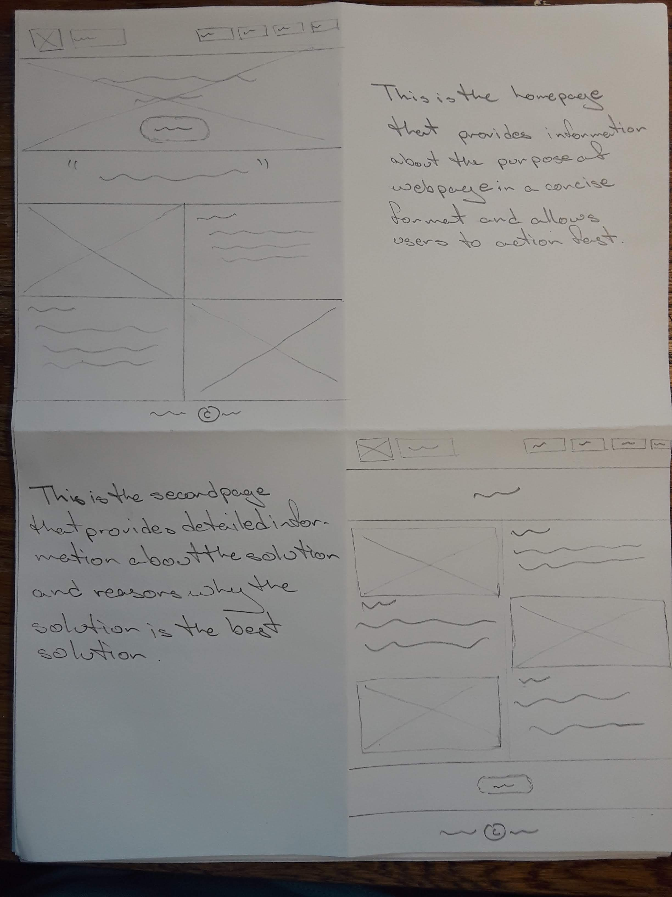
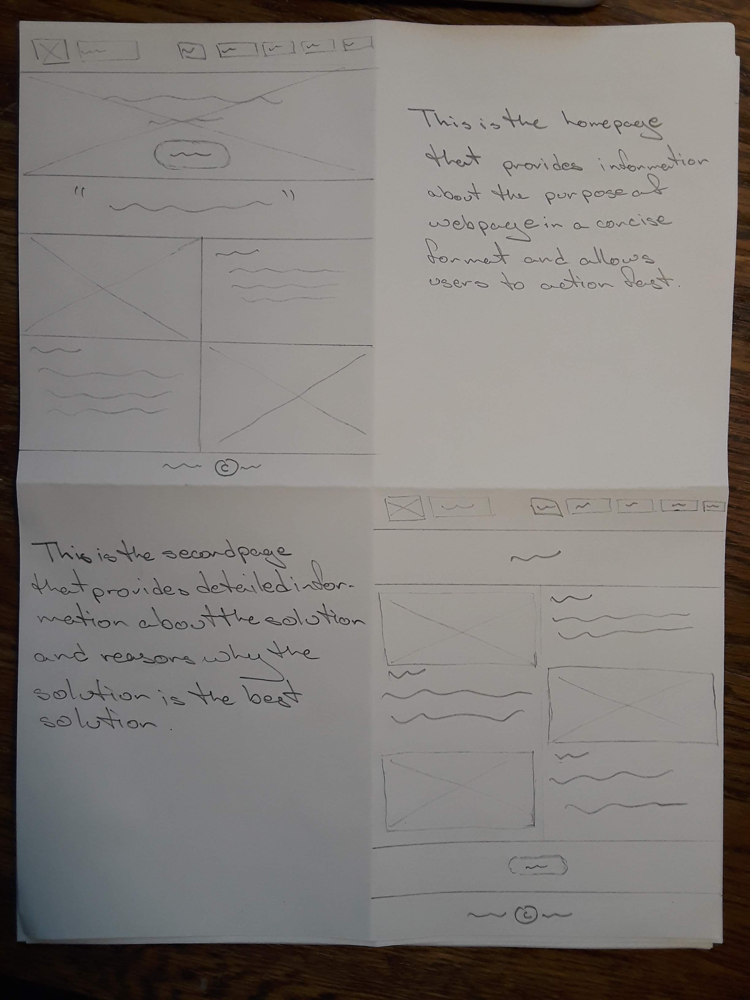
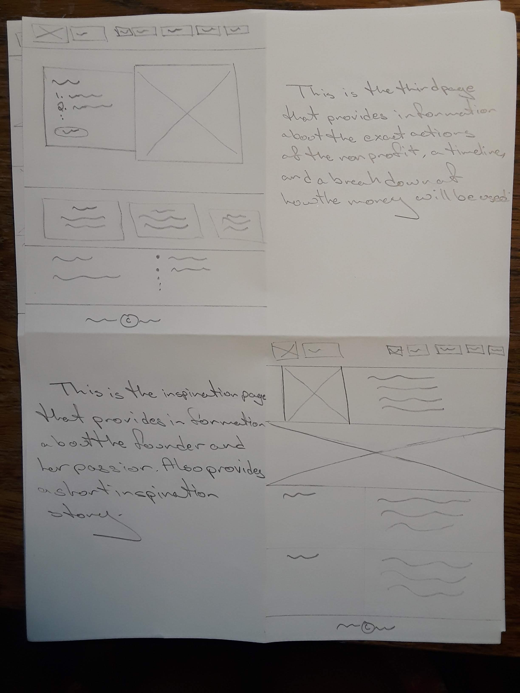
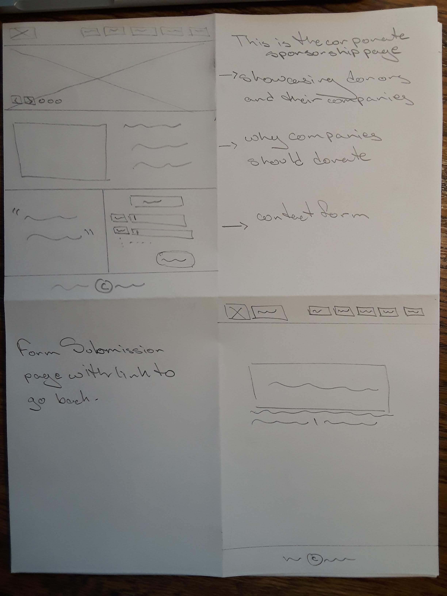

# Project 1: Design Journey

Be clear and concise in your writing. Bullets points are encouraged.

**Everything, including images, must be visible in Markdown Preview.** If it's not visible in Markdown Preview, then we won't grade it. We won't give you partial credit either. This is your warning.

## Existing Design, Planning, & Refined Design (Milestone 1)

### Existing Site: Target Audience I (Milestone 1)
> Who is your _existing_ site's target audience?

The general public that may be interested in donating to nonprofit organizations.

### Existing Site: Target Audience I Needs (Milestone 1)
> Document your existing site's target audience's needs.
> List each need below. There is no specific number of needs required for this, but you need enough to do the job.

- Need #1: Information
  - **Need**
    - > What does your existing target audience need?
    - Information about what the non-profit is trying to solve and a gist of what they will do to solve it.

  - **Design Choices**
    - > How does your existing site meet this need?
    - Home page provides infomation about the lack of menstrual resources in developing countries, how it is negatively affecting people's lives, and how the non-profit will go about solving this problem.

  - **Need**
    - What action specifically will the non-profit will take to solve it?

  - **Design Choices**
    - The Project page provides information about the steps the non-profit will take to enact their solution and a basic timeline of when everything will happen.

  - **Need**
   - What are the benefits of this solution?

  - **Design Choices**
    - The All About Cups page gives the three most important criteria that this solution addresses and feasibly solves to convince the audience that this is the best solution for the problem.

  - **Need**
    - How one can go about donating

  - **Design Choices**
    - Buttons appear throughout most of the pages that ask the audience to take action and leads them to a donation page.

  - **Need**
   - What will happen to their money once they have donated(how will it be used)

  - **Design Choices**
    - The Project Page includes a block of Budget information explaning exactly how the donations will be used.

  - **Need**
  - Why is the non profit working on this problem

  - **Design Choices**
    - The Inspiration page writes a short story that allows to audience to empathize with the victims of this problem and understand the urgency of it.

  - **Need**
    - Who is working at the non-profit to solve the problem

  - **Design Choices**
    - The Inspiration page also gives information about the founder of the non-profit and why she is interested in solving the problem thus gaining more trust from the audience.

  - **Need**
    - Statistics about the solution and the problem.

  - **Design Choices**
    - Embedded into each of the text areas throughout the site.

- Need #2: Navigation
  - **Need**
    - A way to go to the different pages and easily manuever between them.

  - **Design Choices**
    - The navigation bar is implemented for this need. It highlights the page the user is currently on thus making it easier for them to understand where they are on the site.

- Need #3: Fast Information
  - **Need**
    - The user who doesn't have a lot of time but is still interested in the non-profit needs to gather information fast and be convinced to donate.

  - **Design Choices**
    - Showcase areas, big quotes, and header are used to help guide the user to find the information they think is important as fast as possible.

- Need #4: Aesthetically Pleasing
  - **Need**
    - The user needs to feel invited to the website to be convinced to donate.

  - **Design Choices**
    - Pictures are used throughout the website, so that users don't get bored reading lots of text. The color scheme of the website is consistent throughout the different pages and to the purpose of the non-profit so that the user can feel immeresed into the subject.


### Existing Site: Design/Sketches (Milestone 1)
> Sketch your existing site. Include these sketches here.
> DO NOT COPY SKETCHES FROM THE ORIGINAL ASSIGNMENT! Create new sketches here. This is part of the design process to get you thinking about the strengths/weaknesses of the current design.
> Provide a brief explanation _underneath_ each sketch.




The description of each page is next to the sketches.

### Refined Site: Target Audience II (Milestone 1)
> Who is your additional/secondary target audience?

Corporate businesses who may interested in donating products or services.

### Refined Site: Target Audience II Needs (Milestone 1)
> Document target audience II's needs.
> List each need below. There is no specific number of needs required for this, but you need enough to do the job.

- Need #1: Corporate Invitation
  - **Need**
    - > What does your target audience II need?
    - Information about how businesses can benefit from donating.
  - **Design Ideas and Choices**
    - > How will you refine your site's design to meet this need?
    - An information box listing ways of corporate involvement and how they can benefit from it.

- Need #2: Contact form
  - **Need**
    - A way to contact the non-profit to either find out more information or donate products.
  - **Design Ideas and Choices**
    - A form to submit from the website to contact the non-profit directly.

- Need #3: Sponsor Advertisement
  - **Need**
    - A feature that shines light on businesses that donated so they can get more exposure.
  - **Design Ideas and Choices**
    - An advertisement area listing the companies that helped, information about their mission, and a link to thier site.

- Need #4: Solution Usage
  - **Need**
    - To inform how to use the solution implemented
  - **Design Ideas and Choices**
    - A feature, maybe pictures, a video, or a list explaning how to use the solution.


### Refined Site: Content Organization/Navigation (Milestone 1)
> Identify the content that is necessary for both target audiences.
> List the content here.
> Don't forget to include the form.

- Information
  - Home Page
  - All About Cups
  - The Project
  - Inspiration
  - Stattistics
  - Timeline
- Fast Information
  - Quotes
  - Showcase Areas
  - Donation Buttons
  - Headers
- Corporate Invitation
- Navigation
- Contact Form
- Advertisement Feature
- Solution Usage


> Organize the content for the target audience and identify possible pages for the content using card sorting.
> First, organize the content for target audience I. Document your card sorting by taking a photo and including it here.


> Second, organize the content for target audience II. Document your card sorting by taking a photo and including it here.


> Next, organize the content for both target audiences. Document your card sorting by taking a photo and including it here.


> Lastly, list the pages that resulted from your final card sort (i.e. your site's navigation).

- Homepage
- All About Cups
- The Project
- Inspiration
- Sponsors(Corporate Invitation)


### Refined Site: Design (Milestone 1)
> Refine the design of your site to meet the needs of _both_ target audiences.
> Include sketches of each page of the refined design.
> Provide a brief explanation _underneath_ each sketch.
> Document your _entire_ design process. **Show your preliminary sketches and your final sketches.**
> Don't forget the form and confirmation page!







The description of each page is next to the sketches.


### Partial Plan (Milestone 1)
> Using your refined sketches, plan your site's partials.
> You may describe each partial or sketch it. It's up to you!

Since the navigation bar shows up in every page it will be implemented using partial.

Also the footer shows up on every page, thus it will also be implemented using a footer.

---

## Sticky Form Planning (Milestone 2)

### Sticky Form (Milestone 2)
> What controls do you need for your form?


> Plan out your feedback messages for your form. You may sketch (probably the easiest) or write it out.


> How does this form meet the needs of at least one of your target audiences (specify which)?


### Validation Code Plan (Milestone 2)
> Write out your pseudocode plan for handling the validation of the form.

```
WRITE YOUR PSEUDOCODE HERE
```

---

## Complete & Polished Website (Final Submission)

### Target Audiences (Final Submission)
> Tell us how your final site meets the needs of the target audiences. Be specific here. Tell us how you tailored your design, content, etc. to make your website usable by both target audiences.


### Additional Design Justifications (Final Submission)
> If you feel like you haven’t fully explained your design choices in the final submission, or you want to explain some functions in your site (e.g., if you feel like you make a special design choice which might not meet the final requirement), you can use the additional design justifications to justify your design choices. Remember, this is place for you to justify your design choices which you haven’t covered in the design journey. You don’t need to fill out this section if you think all design choices have been well explained in the design journey.


### Self-Reflection (Final Submission)
> Reflect on what you learned during this assignment. How have you improved from 1300? What things did you have trouble with?
